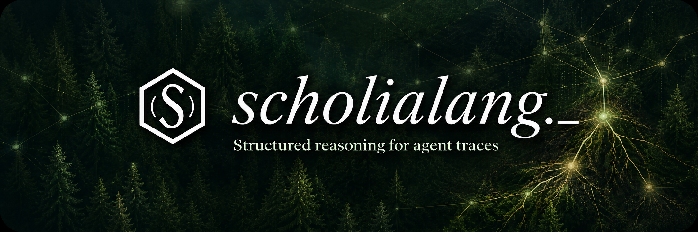

<p align="center">
  
</p>

<p align="center">
  <a href="https://scholialang.org">Website</a> ·
  <a href="https://github.com/dougfirlabs/scholialang-spec">Spec</a> ·
  <strong>MCP</strong> ·
  <a href="https://github.com/dougfirlabs/scholialang">Python</a> ·
  <a href="https://github.com/dougfirlabs">Doug Fir Labs</a>
</p>

# scholialang-mcp

Scholia helps agentic systems preserve reasoning state, use tools without
quality loss, and reduce context cost across long-horizon work.
`scholialang-mcp` is the integration surface for that: an MCP server, an LSP
server, host recipes for Codex, Claude Code, and Ollama, and local DAG access
to captured traces.

This repo provides:

- an MCP server exposing Scholia atlas lookup tools over stdio
- an MVP LSP server for editor navigation in `.scholia` traces
- provider stubs for Claude, Codex, Ollama, and OpenAI host adapters
- **three release-ready plugins** for the major coding harnesses, each
  with the same stdio MCP server, the same SQLite-backed local DAG,
  the same validator for the stable Scholia v0.6.2 language grammar, and shared storage:
  - `plugins/codex/scholialang/` — Codex plugin
  - `plugins/claude-code/scholialang/` — Claude Code plugin
  - `plugins/ollama/scholialang/` — Ollama / local-model recipes for
    Continue.dev, Cline, open-webui, and generic stdio hosts

The repo is intentionally separate from `scholialang`, which contains the
language model, parser, validator, and serializers. This package depends on
`scholialang>=0.7.2,<0.8` and tracks the `scholialang-spec` additive
`fingerprint=` contract (over the v0.6.2 shared conformance corpus).

> **Two version axes:** `0.7.2` is the Python package/plugin release. `v0.6.2`
> is the stable Scholia language grammar it implements. References to “v0.6”
> in grammar documentation do not mean that an older `0.6.x` package is
> installed. Public UI and bundle copy should always name both axes.

## Install

For agent hosts, install the host plugin first. The plugins bundle the stdio MCP
server and vendored validator snapshot, so normal Codex, Claude Code, and
Ollama-backed usage does not require a Python package install or a curl
installer.

Install the Codex plugin directly from the public GitHub marketplace:

```sh
codex plugin marketplace add https://github.com/dougfirlabs/scholialang-mcp.git
codex plugin add scholialang@scholialang-mcp
codex plugin list
```

Install the Claude Code plugin from the same marketplace:

```sh
claude plugin marketplace add https://github.com/dougfirlabs/scholialang-mcp.git --scope user
claude plugin install scholialang@scholialang-mcp --scope user
```

Install the Python package only when you want the standalone atlas MCP server,
the LSP server, or local package development:

```sh
python -m pip install scholialang-mcp
```

For local development:

```sh
python -m venv .venv
. .venv/bin/activate
python -m pip install -e ".[dev]"
pytest
```

## MCP Server

Run the MCP server against a workspace root:

```sh
python -m scholialang_mcp --repo-root /path/to/repo
```

The server speaks JSON-RPC over stdio through a dual-era adapter. MCP
2026-07-28 clients use stateless per-request `_meta` and `server/discover`;
pre-2026 clients retain the legacy `initialize` lifecycle. Both eras expose
`tools/list` and `tools/call`.

Tools:

- `lookup_file_summary(path)`
- `lookup_directory_summary(path)`
- `lookup_feature_summary(feature)`
- `lookup_kb_summary(path)`
- `lookup_prd_summary(path)`
- `lookup_doc_summary(path)`
- `get_tree()`
- `regenerate(path)`

## License

The `scholialang-mcp` protocol tooling, plugins, and host integration code are
dual-licensed under either MIT or Apache-2.0, at your option. See `LICENSE`,
`LICENSE-MIT`, and `LICENSE-APACHE`.

The normative Scholia specification prose lives in `scholialang-spec` and is
licensed separately under CC-BY-4.0.

Artifacts are read from a generic `.scholia-atlas/` directory when present.
Missing artifacts return structured `not_generated_yet` responses so host
agents can fall back to ordinary file reads. Regeneration is host-specific in
v0.6 and returns `regenerate_unavailable` unless a host adapter enables it.

### Codex Atlas MCP Snippet

To expose the atlas lookup server globally to Codex, add the snippet printed by:

```sh
python -m scholialang_mcp codex-config --repo-root /path/to/repo
```

The command does not edit user config; it prints the `[mcp_servers]` section so
installers and host-specific packages can apply it with explicit user consent.

### Codex Trace MCP Fallback

The trace/DAG tools used by the Codex plugin (`scholia_dag_start`,
`scholia_dag_add_atom`, `scholia_codex_import_thread`, and related tools) are
served by the bundled Codex plugin server, not by the atlas lookup server above.
Normally, install the Codex plugin from the GitHub marketplace. If a Codex
thread loads the plugin metadata but does not expose working `scholia_*` tools,
clone the repo and register the bundled server as a direct MCP fallback:

```sh
git clone https://github.com/dougfirlabs/scholialang-mcp.git
cd scholialang-mcp
codex mcp add scholialang \
  -- python3 "$PWD/plugins/codex/scholialang/scripts/scholialang_mcp_server.py"
```

Or print the equivalent `~/.codex/config.toml` fallback snippet:

```sh
python -m scholialang_mcp codex-trace-config --repo-root /path/to/scholialang-mcp
# from an uninstalled source checkout:
PYTHONPATH=src python3 -m scholialang_mcp codex-trace-config --repo-root /path/to/scholialang-mcp
```

## Harness Plugins

Three release-ready plugin trees ship with this repo, one per major
coding harness. Each plugin bundles the same stdio MCP server, the same
local SQLite DAG store, the validator for the stable Scholia v0.6.2 grammar, and the
same Codex rollout importer. Traces written in one harness are visible
from the other two (shared `~/.scholialang/scholialang.sqlite3`).

| Harness | Tree | Install |
| --- | --- | --- |
| Codex | `plugins/codex/scholialang/` | `codex plugin marketplace add https://github.com/dougfirlabs/scholialang-mcp.git`, then `codex plugin add scholialang@scholialang-mcp` |
| Claude Code | `plugins/claude-code/scholialang/` | `claude plugin marketplace add https://github.com/dougfirlabs/scholialang-mcp.git --scope user`, then `claude plugin install scholialang@scholialang-mcp --scope user` |
| Ollama (Continue / Cline / open-webui / generic stdio) | `plugins/ollama/scholialang/` | Drop a snippet from `recipes/` into your harness config |

Each plugin's tool surface is identical:

- `scholia_dag_*` — local SQLite DAG traces
- `scholia_trace_*` — compatibility aliases
- `scholia_catalog`, `scholia_lookup` — reference lookups across the
  v0.6 closed-set vocabulary (32 atom kinds, 11 canonical
  operators, v0.6 structural primitive closed sets for `Edge`, `Effect`,
  `Ref`, and `Meta`, and the criticality ladder)
- `scholia_lint_snippet` — stable Scholia v0.6.2 grammar validation (closed-set
  atoms, reference completeness, decision closure, action recording,
  hypothesis evaluation, retract consistency, constraint respect, goal
  declaration, operator vocabulary, location/edge shape, Concluding
  closure errors, and warning checks). Pass `mode='tag_balance'` for
  the legacy tag-only check.
- `scholia_lint_trace` — per-rule structured error and warning output
  for CI gates and dashboards
- `scholia_codex_import_thread` — import Codex rollout JSONL as an
  event-sourced exhaust DAG

The validator prefers the installed `scholialang` Python package and
falls back to the vendored snapshot at
`<plugin>/scripts/_scholia_vendored/`. Check the `lint_engine` field
returned by `scholia_catalog` to see which engine is active.

### Storage Model

By default every plugin writes to `~/.scholialang/scholialang.sqlite3`,
so traces captured in one harness are visible from the others. Set
`SCHOLIALANG_HOME` before launching the harness to override the storage
root.

### Project-Local Trace Storage

For project work, prefer a repository-local storage root so Scholialang
traces travel with the checkout during development but raw SQLite state
stays private:

```sh
cd /path/to/project
export SCHOLIALANG_HOME="$PWD/.scholialang"
# then launch your harness (codex, claude, your Ollama harness, etc.)
```

That stores the working trace database at:

```text
/path/to/project/.scholialang/scholialang.sqlite3
```

Recommended project `.gitignore` entries:

```gitignore
.scholialang/*.sqlite3
.scholialang/*.sqlite3-*
.scholialang/exports/
```

Project-local storage silos traces per repo — they are no longer shared
across harnesses unless every harness in that project points at the same
`SCHOLIALANG_HOME`. Commit curated SRML or Markdown summaries only after
review. Keep raw full rollout/exhaust imports local unless the repository
is private and the trace has been checked for sensitive tool output.

See each plugin's `README.md` for harness-specific install instructions,
safety model, and release validation commands.

## LSP Server

Run the LSP server:

```sh
python -m scholialang_mcp.lsp --workspace-root /path/to/repo
```

MVP v0.6 LSP scope:

- Hover over `location="path:start:end"` attributes and show the referenced
  source span.
- `textDocument/definition` for resolvable `<Edge target="...">` and
  `<Ref target="...">` values.
- Definition resolution order: workspace-relative file path,
  `path.py::symbol` path prefix, then Scholia atom id in the current document
  when that atom has a `location` attribute.
- Version alignment with the v0.6 language/runtime stack; full v0.6 grammar
  validation is exposed through the MCP lint tools rather than the LSP MVP.

Deferred past the v0.6 LSP MVP:

- completions
- diagnostics as you type
- find-all-references
- document symbols
- rename refactor
- full Python import resolution without an atlas or reverse-index artifact

Editor wiring uses the normal stdio LSP shape. VS Code, Neovim, and Emacs
adapters should launch `scholialang-lsp --workspace-root <repo>`.
